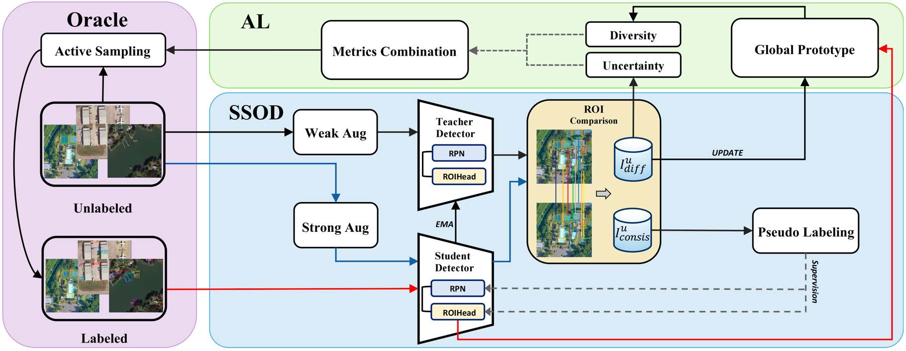
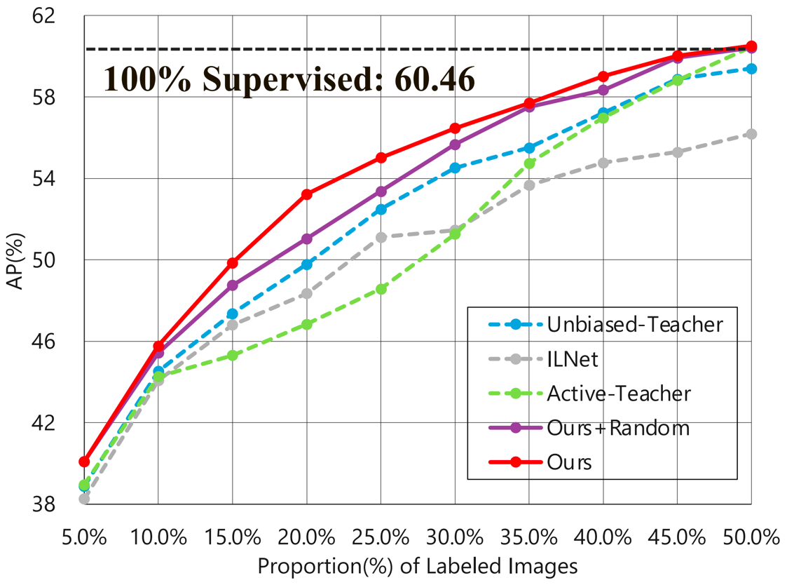
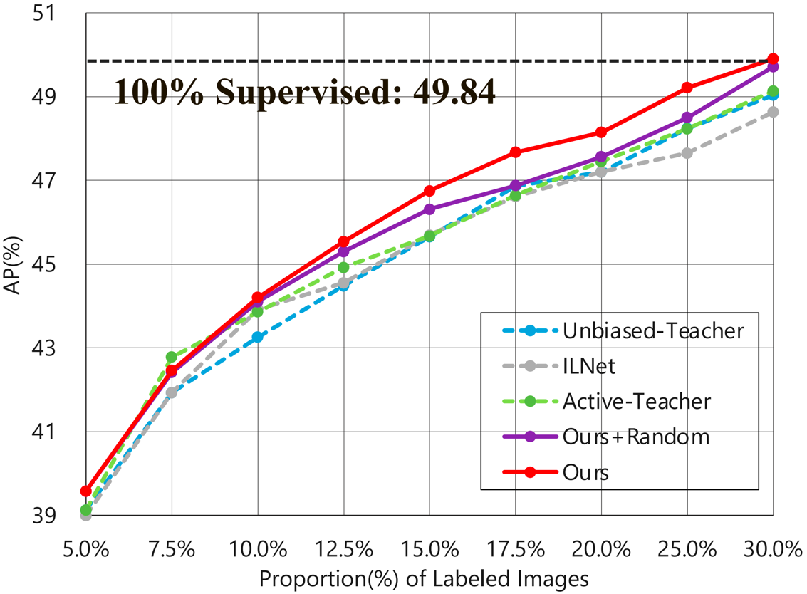

# Boosting Semi-Supervised Object Detection in Remote Sensing Images with Active Teaching
This is an official implementation for ["Boosting Semi-Supervised Object Detection in
Remote Sensing Images with Active Teaching"](https://z-box.netlify.app/uploads/SSOD-AT.pdf). 
It includes the code for SSOD-AT on RSI Object Detection task. The performance on DOTA, DIOR is reported in this repo.

## Introduction
The overall of our **SSOD-AT**. 
<p align="center">

</p>


## Installation

- Install **detectron2** following the [instructions](https://detectron2.readthedocs.io/tutorials/install.html).

- Install **SSOD-AT** via pip:
```
python3 -m pip install -e .
```

## Dataset Preparation
- Download [DOTA-v1.0](https://captain-whu.github.io/DOTA/results.html) and [DIOR](http://www.escience.cn/people/JunweiHan/DIOR.html)
- Following ```tools/prepare_dota_1024.py``` to convert them to COCO format
- Divide DOTA and DIOR into 2:1 for training and testing, respectively.
### Expected dataset structure exemple:
```
dota/
  annotations/
    train.json
  train/
    images/
  test/
    images/
```

### Custom dataset
[Use Custom Datasets](https://detectron2.readthedocs.io/tutorials/datasets.html) gives a deeper dive on how to use `DatasetCatalog` and `MetadataCatalog`, and how to add new datasets to them.

## Training
### Step 1. Generate 5% label data partition
```
python ./tools/generate_random_data_partition.py \
        --random-file ./dataseed/random_dota/dota_supervision_5.0.txt \
        --random-percent 5.0 \
        --datasets dota_1024_coco_train,
```

### Step 2. Train a pick model on 5% random data
```
mkdir temp
mkdir temp/dota
mkdir results
mkdir results/dota
mkdir dataseed/dota_pick

python train_net.py \
--num-gpus 2 \
--config configs/dota_coco_1024/dota_coco_1024_sup5_run1.yaml \
OUTPUT_DIR output/dota_1/dota_1024_sup5_run1_32bs DATALOADER.RANDOM_DATA_SEED_PATH dataseed/random_dota/dota_supervision_5.0.txt
```

### Step 3. Use the trained model from step 2 to get the indicator file of the dataset
```
python tools/inference_for_active_pick.py \
        --static-file temp/dota/static_by_random5.json \
        --model-weights output/dota/dota_1024_sup5_run1_32bs/model_best.pth \
        --config configs/dota_coco_1024/dota_coco_1024_sup5_run1.yaml

python tools/active_pick_evaluation.py \
    --static-file temp/dota/static_by_random5.json \
    --indicator-file results/dota/5random_0active
```

### Step 4. Use the indictor file from step 3 to generate pick data and merge random data
```
python tools/generate_pick_merge_random_data_partition.py \
    --random-file dataseed/random_dota/dota_supervision_5.0.txt \
    --random-percent 5.0 \
    --indicator-file results/dota/5random_0active.txt \
    --pick-percent 5.0 \
    --reverse True \
    --save-file dataseed/dota_pick/active5+random5.txt
```

### Step 5. Train a model from scratch using the 10% data partition from step 4
```
python ./tools/train_net.py \
--num-gpus 2 \
--config configs/dota_coco_1024/dota_coco_1024_sup10_run1.yaml \
SOLVER.IMG_PER_BATCH_LABEL 16 SOLVER.IMG_PER_BATCH_UNLABEL 16 OUTPUT_DIR output/dota/dota_1024_sup10_run1 DATALOADER.RANDOM_DATA_SEED_PATH dataseed/dota_pick/active5+random5.txt MODEL.WEIGHTS output/dota/dota_1024_sup5_run1_32bs/model_best.pth
```

### Step 6. Repeated Step 3 to Step 5 to augment labeled set from 5% to 40%

## Evaluation
Test 20% labeled DOTA for exemple
```
python train_net.py \
      --eval-only \
      --num-gpus 2 \
      --config configs/dota_coco_1024/dota_coco_1024_sup20_run1.yaml \
       SOLVER.IMG_PER_BATCH_LABEL 16 SOLVER.IMG_PER_BATCH_UNLABEL 16 MODEL.WEIGHTS output/dota/dota_1024_sup20_run1_32bs/model_final.pth
```

## Results
- The results figures on **DOTA** and **DIOR** are shown as below:
<div align="center">
    
    
</div>

## Citing SSOD-AT

You will be able to cite this work after the paper is accepted.

## License

SSOD-AT is released under the [Apache 2.0 license](LICENSE).

## Acknowledgement
-   [STAC](https://github.com/google-research/ssl_detection)
-   [unbiased teacher](https://github.com/facebookresearch/unbiased-teacher)
-   [detectron2](https://github.com/facebookresearch/detectron2)
-   [ActiveTeacher](https://github.com/HunterJ-Lin/ActiveTeacher)
